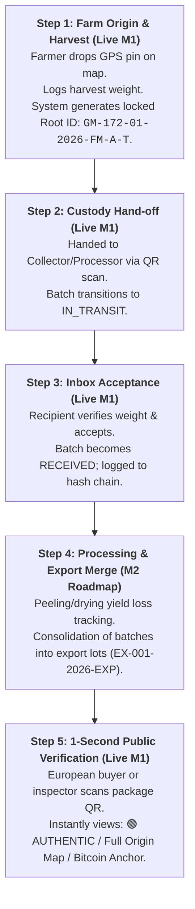

# Executive Brief: Cinnamon Trace Platform
**Audience**: Executive Leadership, Primary Stakeholders, Exporters & Industry Partners  
**Focus**: Commercial Value, Supply Chain Integrity, EUDR Compliance, and Blockchain Architecture  

---

## 1. Executive Summary

**Cinnamon Trace** is an enterprise-grade, mobile-first traceability platform engineered specifically for Sri Lanka's Ceylon Cinnamon industry. It guarantees unbroken, verifiable provenance from smallholder farm plots to European export containers.

By marrying **instant offline mobile data capture** with a **zero-cost Bitcoin-anchored cryptographic integrity engine**, Cinnamon Trace transforms regulatory compliance (such as the mandatory EU Deforestation Regulation) from an existential threat into an unassailable commercial advantage.

---

## 2. Why We Created This App & The Business Stakes

```
               TRADITIONAL SUPPLY CHAIN                         CINNAMON TRACE PLATFORM
   ┌──────────────────────────────────────────────┐       ┌──────────────────────────────────────────────┐
   │ • Paper-based logbooks (easily forged)       │       │ • Digital GPS Plot Mapping (EUDR-ready)      │
   │ • No geospatial coordinates or plot proof    │  ───► │ • Immutable Root Batch Numbers & Custody QR  │
   │ • High risk of EU border detention & fines   │       │ • Zero-Cost Bitcoin Public Proof of Origin   │
   │ • Farmers trapped in informal cash sales     │       │ • Guaranteed European Market Access          │
   └──────────────────────────────────────────────┘       └──────────────────────────────────────────────┘
```

### The 2 Core Drivers:

1. **The Mandatory EUDR Compliance Imperative**:
   - The European Union Deforestation Regulation (EUDR) legally mandates that every shipment of agricultural commodities entering the EU must provide **exact GPS polygon/point coordinates** of the farm plots of origin and irrefutable proof that the crop was not produced on deforested land after December 31, 2020.
   - Paper records, self-declarations, and generalized regional certificates are legally invalid at EU customs. Without verifiable digital coordinates tied directly to export lots, Sri Lankan exporters face immediate container rejections, customs impoundment, and severe fines up to 4% of annual EU turnover.
   - Cinnamon Trace captures farm plot coordinates on mobile devices at the farm gate, immutably links them to each harvest batch, and outputs a one-click digital compliance pack for European customs inspectors.
2. **Smallholder Empowerment & Direct Sourcing**:
   - 85%+ of Sri Lanka's cinnamon is cultivated by smallholder farmers who lack formal digital visibility.
   - Cinnamon Trace gives every farmer a verified digital profile and permanent ownership record of their harvest batches, unlocking fair pricing and direct exporter procurement programs.

---

## 3. The Operational Flow (Live in App vs. Roadmap)

The platform is designed to operate seamlessly in rural environments with intermittent connectivity:



- **Step 1 — Farm Origin & Harvest (Live in M1 MVP)**: Farmer logs in via phone number / biometric authentication. Drops a single map pin on their plot to record GPS coordinates and acreage. Logs harvest weight. System auto-generates a locked, collision-free batch ID (e.g. `GM-172-01-2026-FM-A-T`) and offline QR code.
- **Step 2 & 3 — Custody Transfer & Inbox Acceptance (Live in M1 MVP)**: Physical transfer is initiated via recipient phone number or QR scan (`SALE` or `HANDOFF`). Batch enters `IN_TRANSIT`. The recipient receives an Inbox notification, verifies the incoming weight, and clicks `Accept` (status becomes `RECEIVED`). An immutable event is logged on the hash chain. Upward farm ancestry is visible; downstream sales stay private.
- **Step 4 — Processing & Export Lot Merging (Phase 2 / M2 Roadmap)**: Future screens for peeling, quilling, and drying yield tracking with automated loss calculations, plus multi-batch container consolidation (`EX-001-2026-EXP`). Pre-architected in the current PostgreSQL database schema (`parents`, `MERGED_IN`, `stage_suffix`).
- **Step 5 — 1-Second Public Verification (Live in M1 MVP)**: Anyone scanning the package QR code views a public web page showing the full timeline, plot locations, and cryptographic status in 1 second—no app download required.

---

## 4. Blockchain Integrity Explained Simply: The "Digital Notary"

Many stakeholders fear blockchain means complex cryptocurrencies, fluctuating gas fees, and difficult crypto wallets. **Cinnamon Trace eliminates all of that.**

```
                      THE 2-TIER INTEGRITY ARCHITECTURE
  
  TIER 1: LOCAL TAMPER-EVIDENT CHAIN          TIER 2: GLOBAL PUBLIC NOTARY (BITCOIN)
  ┌─────────────────────────────────┐         ┌─────────────────────────────────────┐
  │  Harvest Hash (SHA-256)         │         │                                     │
  │         │                       │         │   Every night at midnight:          │
  │         ▼                       │         │   All daily hashes condensed into   │
  │  Transfer Hash (links to #1)    │────────►│   one Merkle Root and anchored to   │
  │         │                       │         │   the Bitcoin Blockchain via        │
  │         ▼                       │         │   OpenTimestamps.                   │
  │  Processing Hash (links to #2)  │         │                                     │
  └─────────────────────────────────┘         └─────────────────────────────────────┘
   Any retroactive edit breaks the chain!      $0 Gas Fees · Zero Crypto Wallets
```

1. **Tier 1 — The Cryptographic Domino Chain (PostgreSQL + SHA-256)**:
   - Each event (harvest, transfer, processing) generates a mathematical digital fingerprint that incorporates the fingerprint of the preceding event.
   - If an unauthorized database administrator or malicious actor alters even a single character or weight figure retroactively, the math fails, and the system flags **TAMPERED**.
2. **Tier 2 — The Global Anchor (Bitcoin via OpenTimestamps)**:
   - To prove to European buyers that *we ourselves* didn't secretly rewrite the database, we submit the day's root fingerprint to **Bitcoin** via the open-source OpenTimestamps protocol.
   - **Cost to Business**: **$0 / month**.
   - **Farmer Experience**: **Zero wallets, zero tokens, zero friction**.
   - **Proof Strength**: Permanent, mathematically irrefutable public proof of existence anchored in the most secure decentralized network in human history.
3. **The 3 Clear Public Verdicts**:
   - 🟢 **AUTHENTIC**: Chain unbroken and verified against the Bitcoin timestamp.
   - 🟡 **PENDING**: New harvest (recorded today; hash-chain intact; queued for nightly Bitcoin block anchor).
   - 🔴 **TAMPERED**: Cryptographic signature discrepancy; historical record was altered!

---

## 5. Strategic ROI & Commercial Impact

| Pillar | Without Cinnamon Trace | With Cinnamon Trace |
|:---|:---|:---|
| **EU Market Access** | Risk of customs border detention under EUDR regulations. | **100% Guaranteed EUDR Compliance** with one-click GPS coordinate export. |
| **Price Realization** | Cinnamon sold as undifferentiated bulk commodity. | **15% - 25% Brand Value Uplift** for certified Pure Ceylon Provenance. |
| **Customer Trust** | Vulnerable to competitor claims and Cassia substitution. | **Public 1-Second Proof** available to any buyer or retailer worldwide. |
| **Operational Overhead**| Paper filings, audit panic, and manual trace queries. | **Automated Digital Ledger** with offline mobile sync for field teams. |

---

## 6. Key Takeaway for the Board

> *"Cinnamon Trace is not a speculative crypto experiment. It is a high-utility, zero-cost, battle-tested compliance weapon that protects Sri Lanka's most iconic agricultural export and opens premium global markets."*
