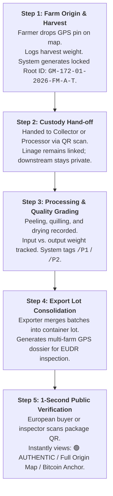

# Executive Brief: Cinnamon Trace Platform
**Audience**: Executive Leadership, Primary Stakeholders, Exporters & Industry Partners  
**Focus**: Commercial Value, Supply Chain Integrity, EUDR Compliance, and Blockchain Architecture  

---

## 1. Executive Summary

**Cinnamon Trace** is an enterprise-grade, mobile-first traceability platform engineered specifically for Sri Lanka's Ceylon Cinnamon industry. It guarantees unbroken, verifiable provenance from smallholder farm plots to European export containers.

By marrying **instant offline mobile data capture** with a **zero-cost Bitcoin-anchored cryptographic integrity engine**, Cinnamon Trace transforms regulatory compliance (such as the mandatory EU Deforestation Regulation) from an existential threat into an unassailable commercial advantage.

---

## 2. Why We Created This App & The Business Stakes

```
               TRADITIONAL SUPPLY CHAIN                         CINNAMON TRACE PLATFORM
   ┌──────────────────────────────────────────────┐       ┌──────────────────────────────────────────────┐
   │ • Paper-based logbooks (easily forged)       │       │ • Digital GPS Plot Mapping (EUDR-ready)      │
   │ • Opaque middlemen blending Cassia adulterant│  ───► │ • Immutable Root Batch Numbers & Custody QR  │
   │ • Risk of EU export bans & border rejections │       │ • Zero-Cost Bitcoin Public Proof of Origin   │
   │ • Farmers trapped in commodity pricing       │       │ • Premium Price Uplift for Certified Ceylon  │
   └──────────────────────────────────────────────┘       └──────────────────────────────────────────────┘
```

### The 3 Core Drivers:

1. **The EUDR Compliance Mandate (The "Burn-the-Ships" Reality)**:
   - The European Union Deforestation Regulation (EUDR) legally mandates that every shipment of agricultural commodities entering the EU must provide **exact GPS polygon/point coordinates** of the farm plots of origin and irrefutable proof that the crop was not produced on deforested land after 2020.
   - Paper records and self-signed certificates are no longer accepted at EU customs. Without verifiable digital coordinates tied directly to export lots, Sri Lankan exporters face container rejections, customs impoundment, and severe fines.
2. **Defending Pure Ceylon Cinnamon Against Cassia Adulteration**:
   - Sri Lanka holds a natural monopoly on **Pure Ceylon Cinnamon (*Cinnamomum verum*)**, prized for its delicate sweet flavor and ultra-low coumarin levels (safe for regular consumption).
   - In global markets, cheap *Cassia* (high in toxic coumarin) is routinely blended or passed off as Ceylon Cinnamon, eroding national brand value and depressing prices.
   - Cinnamon Trace delivers **cryptographic proof of authentic origin**, safeguarding the 20-30% price premium Ceylon Cinnamon commands.
3. **Smallholder Empowerment & Direct Sourcing**:
   - 85%+ of Sri Lanka's cinnamon is cultivated by smallholder farmers who often lack financial and digital visibility.
   - Cinnamon Trace gives every farmer a verified digital profile and permanent ownership record of their harvest batches, unlocking fair pricing and direct exporter procurement programs.

---

## 3. The 5-Step Operational Flow (Simple & Pragmatic)

The platform is designed to operate seamlessly in rural environments with intermittent connectivity:



- **Step 1 (Farmer / Root)**: Farmer logs in via phone number / biometric authentication. Drops a single map pin on their plot. Logs harvest weight. System auto-generates a locked, collision-free batch ID (e.g. `GM-172-01-2026-FM-A-T`) and offline QR code.
- **Step 2 (Collector / Handoff)**: Physical transfer is confirmed via recipient QR scan. Lineage is locked; farmers can trace their batch history, while commercial downstream channels remain protected.
- **Step 3 (Processor / Value Add)**: Processors log peeling, grading, and moisture readings. Yield and loss rates are automatically computed.
- **Step 4 (Exporter / Lot Merge)**: Multiple farm batches are consolidated into an export lot (e.g. `EX-001-2026-EXP-MERGED(x5)`). The system compiles all underlying farm plot GPS coordinates into a one-click digital compliance pack.
- **Step 5 (Consumer & Auditor Verification)**: Anyone scanning the QR code on a jar or bulk container is taken to a public web page showing the full timeline, plot locations, and cryptographic status.

---

## 4. Blockchain Integrity Explained Simply: The "Digital Notary"

Many stakeholders fear blockchain means complex cryptocurrencies, fluctuating gas fees, and difficult crypto wallets. **Cinnamon Trace eliminates all of that.**

```
                      THE 2-TIER INTEGRITY ARCHITECTURE
  
  TIER 1: LOCAL TAMPER-EVIDENT CHAIN          TIER 2: GLOBAL PUBLIC NOTARY (BITCOIN)
  ┌─────────────────────────────────┐         ┌─────────────────────────────────────┐
  │  Harvest Hash (SHA-256)         │         │                                     │
  │         │                       │         │   Every night at midnight:          │
  │         ▼                       │         │   All daily hashes condensed into   │
  │  Transfer Hash (links to #1)    │────────►│   one Merkle Root and anchored to   │
  │         │                       │         │   the Bitcoin Blockchain via        │
  │         ▼                       │         │   OpenTimestamps.                   │
  │  Processing Hash (links to #2)  │         │                                     │
  └─────────────────────────────────┘         └─────────────────────────────────────┘
   Any retroactive edit breaks the chain!      $0 Gas Fees · Zero Crypto Wallets
```

1. **Tier 1 — The Cryptographic Domino Chain (PostgreSQL + SHA-256)**:
   - Each event (harvest, transfer, processing) generates a mathematical digital fingerprint that incorporates the fingerprint of the preceding event.
   - If an unauthorized database administrator or malicious actor alters even a single character or weight figure retroactively, the math fails, and the system flags **TAMPERED**.
2. **Tier 2 — The Global Anchor (Bitcoin via OpenTimestamps)**:
   - To prove to European buyers that *we ourselves* didn't secretly rewrite the database, we submit the day's root fingerprint to **Bitcoin** via the open-source OpenTimestamps protocol.
   - **Cost to Business**: **$0 / month**.
   - **Farmer Experience**: **Zero wallets, zero tokens, zero friction**.
   - **Proof Strength**: Permanent, mathematically irrefutable public proof of existence anchored in the most secure decentralized network in human history.
3. **The 3 Clear Public Verdicts**:
   - 🟢 **AUTHENTIC**: Chain unbroken and verified against the Bitcoin timestamp.
   - 🟡 **PENDING**: New harvest (recorded today; hash-chain intact; queued for nightly Bitcoin block anchor).
   - 🔴 **TAMPERED**: Cryptographic signature discrepancy; historical record was altered!

---

## 5. Strategic ROI & Commercial Impact

| Pillar | Without Cinnamon Trace | With Cinnamon Trace |
|:---|:---|:---|
| **EU Market Access** | Risk of customs border detention under EUDR regulations. | **100% Guaranteed EUDR Compliance** with one-click GPS coordinate export. |
| **Price Realization** | Cinnamon sold as undifferentiated bulk commodity. | **15% - 25% Brand Value Uplift** for certified Pure Ceylon Provenance. |
| **Customer Trust** | Vulnerable to competitor claims and Cassia substitution. | **Public 1-Second Proof** available to any buyer or retailer worldwide. |
| **Operational Overhead**| Paper filings, audit panic, and manual trace queries. | **Automated Digital Ledger** with offline mobile sync for field teams. |

---

## 6. Key Takeaway for the Board

> *"Cinnamon Trace is not a speculative crypto experiment. It is a high-utility, zero-cost, battle-tested compliance weapon that protects Sri Lanka's most iconic agricultural export and opens premium global markets."*
